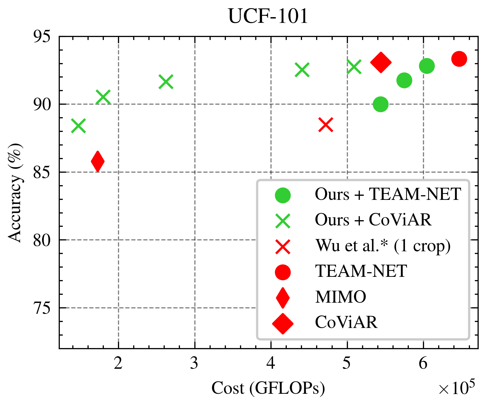

# PKD-WISE: Action Recognition on Compressed Videos 

This is the official implementation for the paper. We provide all the code to replicate our experiments and results. 
* The use of  [CoViAR](https://github.com/chaoyuaw/pytorch-coviar/) as backbone is [here](./COVIAR_backbone/), and the details on reproducing the results are explained the [PKD-WISE-CoViAR](./COVIAR_backbone/README.md). The code is available at `./COVIAR_backbone` directory.

* The use of [TEAM-Net](https://github.com/villawang/TEAM-Net) as backbone is [here](./TEAM_NET_Backbone/), and the details on reproducing the results are explained the [PKD-WISE-TeamNet](./TEAM_NET_Backbone/README.md).
The code is available at `./TEAM_NET_Backbone` directory.

## Environment
We provide `environment.yml` files to recreate the environments
We also have dependency on CoViAR data loader, please see [instructions to install CoViAR dataloader](https://github.com/chaoyuaw/pytorch-coviar/blob/master/GETTING_STARTED.md).

## Results
Our trade off results on UCF-101 and HMDB-51 are shown below when compared to various other works

